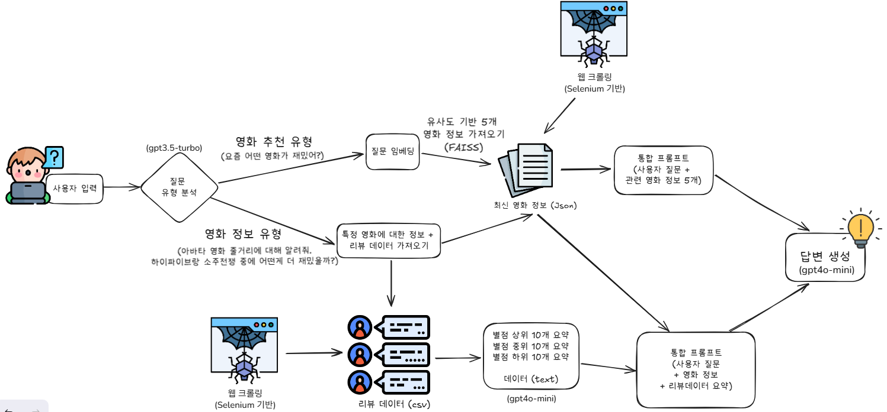

## 25.07.22 이후 배포중단 (사유: 취업으로 인해 서버비 지불X, 서비스를 잠시 종료합니다. )
# 🎬 Filmio: AI 영화 추천 & 리뷰 분석 플랫폼

[🔗 배포 사이트 바로가기](https://sin-yejun.github.io/movie-recommendation)

---

## 프로젝트 개요

**Filmio**는 AI와 최신 데이터 크롤링 기술을 결합하여  
사용자에게 **최신 영화 정보**, **리뷰 분석**, 그리고 **개인 맞춤형 추천**을 제공하는 스마트 영화 비서 서비스입니다.

---

## 🌐 서비스 흐름 (아키텍처 다이어그램)

> - **사용자 입력** → **질문 유형 분석(gpt3.5-turbo)** →  
> - 추천 유형: 임베딩 → FAISS 유사도 검색 → 최신 영화 정보(크롤링) → 통합 프롬프트  
> - 정보 유형: 크롤링 데이터(영화정보+리뷰) → 평점대별 리뷰 요약(gpt4o-mini) → 통합 프롬프트  
> - **최종 생성형 AI 답변(gpt4o-mini)**  

---

## 📍 Filmio의 주요 기능

- ✅ **최신 영화 정보 자동 크롤링**  
  - Selenium 기반 크롤러가 네이버에서 최신 영화 8편의 상세 정보 실시간 수집  
- ✅ **영화 리뷰 크롤링 및 AI 요약**  
  - 실관람객/네티즌/평론가 리뷰를 평점대별로 분석 & 요약  
- ✅ **OpenAI 기반 추천·정보 생성**  
  - gpt3.5-turbo로 질문 유형 판별  
  - gpt4o-mini로 평점대별 리뷰 요약 & 최종 답변 생성  
- ✅ **FAISS 벡터 DB 기반 영화 유사도 검색**  
  - 질문 임베딩 후 최신 영화 데이터에서 가장 유사한 5편 자동 추천  
- ✅ **직관적인 웹 UI**  
  - 사용자 질문 → AI 답변 실시간 표시  
  - 상영 영화 포스터 슬라이더

---

## 🛠️ 주요 파이프라인 상세

1. **최신 영화/리뷰 데이터 크롤링**
    - `영화정보크롤링.py`  
        - Selenium 이용, 네이버에서 최신 영화 정보(제목, 출연, 포스터, 개봉일, 장르, 줄거리 등) 크롤링  
        - 결과는 JSON 파일로 저장  
    - `영화리뷰크롤링.py`  
        - 다양한 평점·리뷰를 수집하여 CSV 파일로 저장

2. **질문 유형 분석**
    - gpt3.5-turbo가 사용자의 질문을 "추천형" / "정보형"으로 분류

3. **영화 임베딩 생성 & 유사도 검색 (추천형)**
    - OpenAI 임베딩 → FAISS로 최신 영화 중 유사 영화 5편 추출  
    - 최신 데이터 기반(웹 크롤링) 정보와 통합 프롬프트 생성

4. **특정 영화 정보/리뷰 분석 (정보형)**
    - 크롤링 데이터에서 해당 영화 + 리뷰 데이터 추출  
    - gpt4o-mini가 평점대별 리뷰(상·중·하위)를 요약  
    - 영화 정보 + 리뷰 요약으로 통합 프롬프트 생성

5. **최종 답변 생성 (gpt4o-mini)**
    - 통합 프롬프트 기반, 사용자의 질문에 맞는 마크다운 기반의 풍부한 답변 생성

6. **웹 인터페이스 (index.html)**
    - 질문 입력 → AI 답변 표시  
    - 상영 영화 포스터 슬라이더 구현

---

## 🔧 기술 스택

- **Python** (크롤링, 임베딩, API)
- **JavaScript, HTML, CSS** (웹 UI)
- **Selenium** (웹 크롤링)
- **OpenAI API** (임베딩, LLM)
- **FAISS** (유사도 기반 벡터 검색)
- **Pandas, JSON** (데이터 처리)
- **FastAPI** (API 서버)
- **Markdown-it** (웹 마크다운 렌더링)
- **Git, VS Code, Chrome WebDriver**

---

## ⚙️ 운영 및 자동화 시스템

### 🎯 배포 및 서버 운영

- **서버 배포:**  
  - [Railway](https://railway.app/)를 이용해 FastAPI 기반 백엔드 서버를 클라우드에서 항상 가동
  - 자동 자원 할당 및 모니터링, 환경 변수 관리(OPENAI_API_KEY 등)는 Railway에서 일괄 관리

- **프론트엔드(웹 UI):**  
  - GitHub Pages를 통해 정적 웹사이트(index.html 등) 배포

---

### 🤖 데이터 크롤링 및 자동화 파이프라인

- **크롤링 & 데이터 갱신 자동화:**  
  - `crawl.yml` (GitHub Actions 워크플로우)  
    - 매일 정해진 시간(한국 시간 00시)에 자동 실행(cron 스케줄)  
    - 저장소 체크아웃 → Docker Compose로 크롤러 컨테이너 빌드/실행 → 최신 영화/리뷰 데이터 수집 및 커밋
    - OPENAI_API_KEY, GH_PAT 등 민감 정보는 GitHub Secrets를 이용해 안전하게 관리

- **Docker Compose 활용:**  
  - 크롤러와 필요한 의존성 환경을 **컨테이너**로 분리/관리  
  - `docker-compose.yml`에 각 서비스(크롤러, 임베딩 생성 등) 정의  
  - GitHub Actions 워크플로우에서 한 번에 build/run  
  - 크롤링 결과를 곧바로 저장소에 반영(커밋/푸시)

---

### 🛡️ CI/CD 및 배포 자동화 흐름

1. **소스코드 변경** → GitHub 저장소 푸시  
2. GitHub Actions에서 테스트/빌드  
3. 최신 데이터 자동 크롤링(매일 자정) → 데이터/임베딩 업데이트  
4. Railway가 서버(백엔드 API) 자동 재배포  
5. 사용자/관리자는 언제든 **항상 최신 영화·리뷰 데이터 기반 AI 추천**을 이용 가능

---

### 📁 주요 자동화 파일

- `.github/workflows/crawl.yml`  
  - 영화 정보/리뷰 데이터 자동 크롤링 & 업데이트

- `docker-compose.yml`  
  - 데이터 크롤링, 임베딩 생성, 서버 구동 등 전체 환경 통합 관리

- `server.py`  
  - FastAPI 기반 REST API, Railway에서 직접 실행

---

## 🚀 프로젝트 성과

- **최신 영화 DB** 자동 구축 및 주기적 업데이트  
    - 매일 자동 크롤링 및 임베딩 파이프라인 운영, **최신 정보가 실시간 반영**
- 실관람객 리뷰 기반, **신뢰도 높은 영화 분석/추천** 제공  
    - 평점대별 리뷰 분석/요약으로 객관적인 영화 정보 제공
- **AI 기반 자동 응답 및 리뷰 요약**으로 **사용자 경험 대폭 향상**  
    - OpenAI 모델 활용, 질문 의도 파악부터 최적 답변까지 완전 자동화
- **슬라이더 등 모던한 웹 UI/UX** 구현  
    - 사용자 친화적 인터페이스로 접근성과 만족도 향상
- **클라우드 기반 서버 운영 및 완전 자동화된 데이터 파이프라인**  
    - Railway 등 클라우드 플랫폼에 백엔드 서버 상시 운영  
    - GitHub Actions + Docker Compose를 이용한 **크롤링/데이터 갱신 CI/CD 자동화**  
    - 민감 정보는 GitHub Secrets, Railway 환경 변수 등으로 안전하게 관리
- **무중단 서비스 및 지속적인 배포(Continuous Deployment)** 실현  
    - 코드/데이터 갱신 시마다 서비스 재시작 없이 최신 기능 및 데이터 제공

---

## 📄 사용법

1. [배포 사이트](https://sin-yejun.github.io/movie-recommendation) 접속
2. 영화 관련 질문 입력 (예: “범죄도시3 줄거리 알려줘”, “액션 영화 추천해줘” 등)
3. AI가 실시간으로 맞춤형 답변 제공

---
